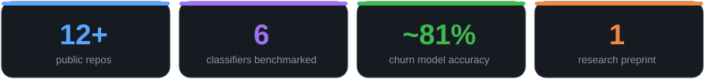
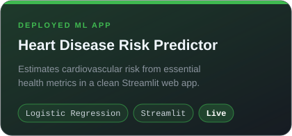
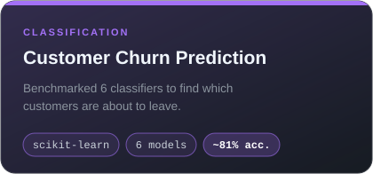
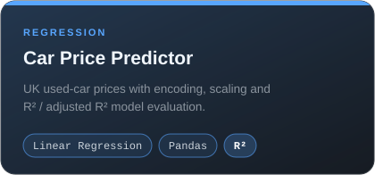
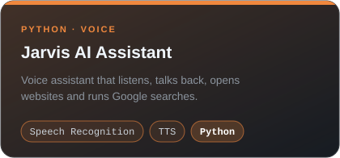
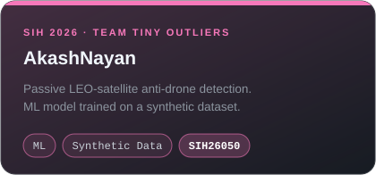
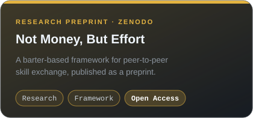
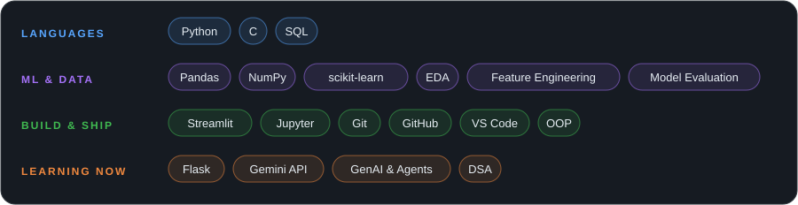
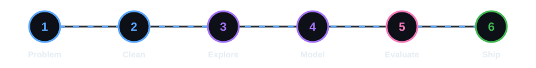

 

 

## 👋 About me

I'm a **Computer Engineering student at Dr. D. Y. Patil Institute of Technology, Pune (SPPU)**, graduating in 2028.
I like projects where a messy dataset ends up as something a real person can *use*: a prediction, a dashboard, a web app.

- 🔬 I build **end-to-end ML projects**: clean data → explore → model → evaluate → deploy
- 🏆 Competed in **Smart India Hackathon 2026** with Team Tiny Outliers
- 🛡️ Member of **SLAB**, my college tech community (AI/ML, blockchain, cybersecurity)
- 📄 Published a **research preprint** on peer-to-peer skill exchange
- 🎯 Looking for **ML / AI / Data Science internships in Pune**

## 🚀 Featured work

<table>
<tr>
<td width="50%"></td>
<td width="50%"></td>
</tr>
<tr>
<td width="50%"></td>
<td width="50%"></td>
</tr>
<tr>
<td width="50%"></td>
<td width="50%"></td>
</tr>
</table>

🔗 Click a card to open the repo (or the paper). More repos:
[Heart-Disease-EDA](https://github.com/aditya-naik23/Heart-Disease-EDA) ·
[HealthCost-Analyzer](https://github.com/aditya-naik23/HealthCost-Analyzer) ·
[ipl-2022-data-analysis](https://github.com/aditya-naik23/ipl-2022-data-analysis) ·
[phishing-detector](https://github.com/aditya-naik23/phishing-detector) ·
[feature-extraction-pandas](https://github.com/aditya-naik23/feature-extraction-pandas) ·
[student-management-system](https://github.com/aditya-naik23/student-management-system) ·
[guessing-game](https://github.com/aditya-naik23/guessing-game)

## 🛠️ Skills

## 🧭 How I build

I care about the **evaluate** step more than most beginners do. I don't stop at "it runs": I compare multiple models (6 classifiers on the churn project), check R² and adjusted R², and ask whether the model generalises.

## 🎓 Beyond the code

| | |
|---|---|
| 🏅 **Certifications** | Introduction to Generative AI (Google Cloud Skills Boost, Jul 2026) · Introduction to Generative AI and Agents (Microsoft) |
| 📄 **Research** | [*Not Money, But Effort: A Barter-Based Framework for Peer-to-Peer Skill Exchange*](https://zenodo.org/records/21872981) (Zenodo preprint) |
| 🏆 **Hackathon** | Smart India Hackathon 2026, Team Tiny Outliers, problem statement SIH26050 |
| 🤝 **Community** | SLAB: AI/ML, blockchain, cybersecurity and network security |

 

